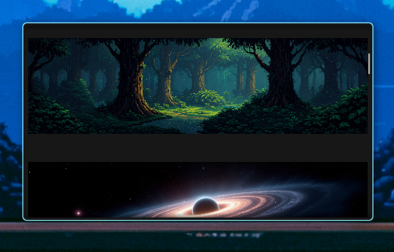

# WallPicker

Simple wallpaper picker utility.



```
Usage: wallpicker [--persist] [--command COMMAND] [DIR]

Positional arguments:
  DIR

Options:
  --persist, -p          Persist, remain after choosing a wallpaper.
  --command COMMAND, -c COMMAND
                         Settings command, expects a command to run [command] [image path]. [default: feh --bg-fill]
  --help, -h             display this help and exit
```

## Table of Contents

- [Features](#features)
- [Setup](#setup)
- [Install](#install)
- [Usage](#usage)
- [Why Another Wallpaper picker?](#why-another-wallpaper-picker)
- [Contributing](#contributing)

## Features

- Persist option, remains open until closed. For when you can't make up your mind. :)
- Configurable command. Defaults to `feh --bg-fill` but can be configured to any command of your choice.

## Setup

- Install golang, you can download it from the official [Go website](https://go.dev/doc/install).
- Set up [fyne](https://docs.fyne.io/started/).

Clone the repository:

```sh
git clone https://github.com/iiiz/wallpicker.git
cd wallpicker
go mod tidy
```

To build the project:

```sh
make build
```

## Install

Install location is `~/.local/bin/wallpicker`

```sh
# clean & build
make
make install
```

## Usage

To run the project:

```sh
# development
go run . /some/dir/with/wallpapers

# build
./bin/wallpicker /some/dir/with/wallpapers
```

## Why another wallpaper picker

I use a very minimal XMonad desktop config and wanted a visual wallpaper picker to bind to a shortcut.
Other options didn't really fit what I was looking for so here we are. ¯\_(ツ)\_/¯

## Contributing

Contributions and forks are welcome!
